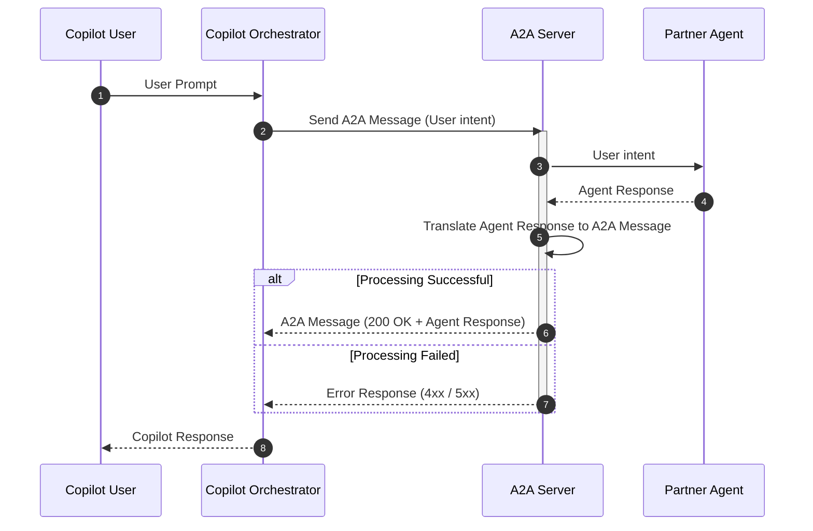
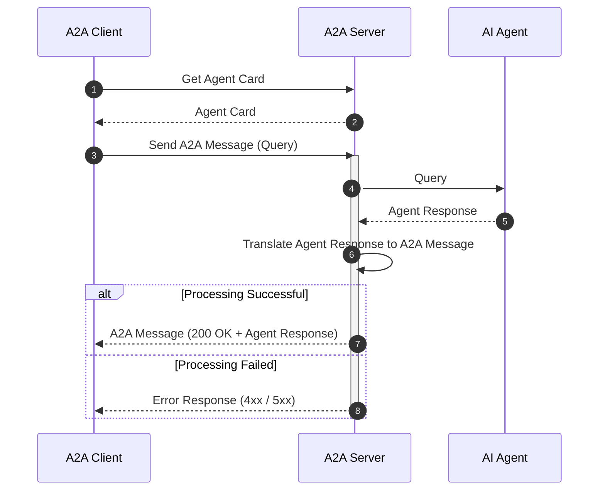
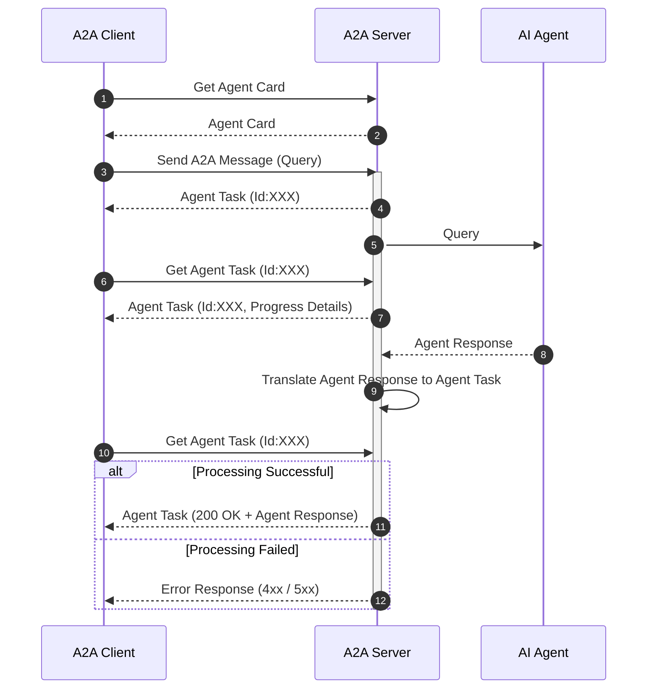

# A2A communication illustrations

## Azure Copilot interaction with A2A integrated Agent

Below diagrams depicts the Azure copilot integrated agents communication.

## Simple A2A Client and Server Interaction

### Synchronous interactions

### Asynchronous interactions

