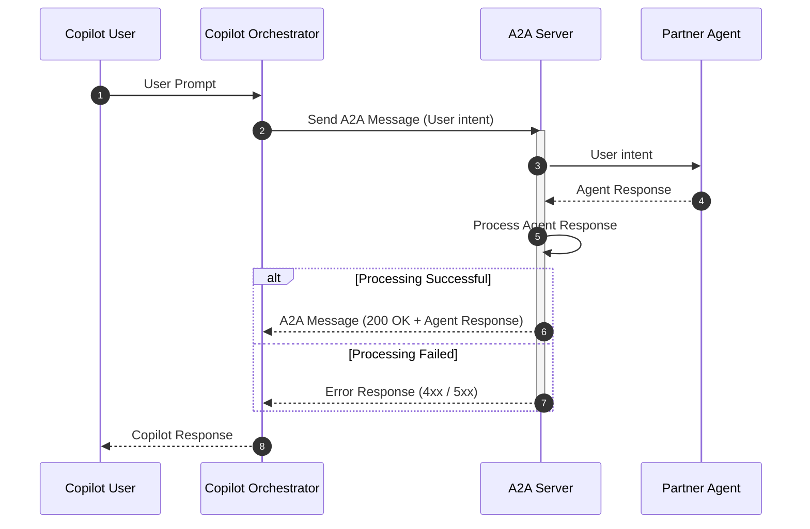

# A2A Client and A2A Server communication

Below diagrams depicts the Azure copilot integrated agents communication.

```mermaid
sequenceDiagram
    autonumber
    participant User as Copilot User
    participant Client as Copilot Orchestrator
    participant Server as A2A Server
    participant Agent as Partner Agent

    User->>Client: User Prompt

    Client->>Server: Send A2A Message (User intent)
    
    activate Server
    Server->>Agent: User intent
    Agent-->>Server: Agent Response
    
    Server->>Server: Process Agent Response

    alt Processing Successful
        Server-->>Client: A2A Message (200 OK + Agent Response)
    else Processing Failed
        Server-->>Client: Error Response (4xx / 5xx)
    end

    deactivate Server

    Client-->>User: Copilot Response
```
